```mermaid
---
title: DFA state diagram
---
stateDiagram-v2
        [*] --> [0;1;2;3;5;8;9;10]
        [25;26;27;28;29] --> [*]
        [2;3;5;6;7;8;9;10;14;15;16;17;18;20;21;22;23;24] --> [25;26;27;28;29] : c
        [2;3;5;6;7;8;9;10;14;15;16;17;18;20;21;22;23;24] --> [2;3;5;6;7;8;9;10;17;18;20;21;22;23;24] : b
        [2;3;5;6;7;8;9;10;14;15;16;17;18;20;21;22;23;24] --> [2;3;4;5;7;8;9;10;11;12;13;17;18;19;20;22;23;24] : a
        [2;3;4;5;7;8;9;10;11;12;13;17;18;19;20;22;23;24] --> [25;26;27;28;29] : c
        [2;3;4;5;7;8;9;10;11;12;13;17;18;19;20;22;23;24] --> [2;3;5;6;7;8;9;10;14;15;16;17;18;20;21;22;23;24] : b
        [2;3;4;5;7;8;9;10;11;12;13;17;18;19;20;22;23;24] --> [2;3;4;5;7;8;9;10;11;12;13;17;18;19;20;22;23;24] : a
        [2;3;5;6;7;8;9;10;17;18;20;21;22;23;24] --> [25;26;27;28;29] : c
        [2;3;5;6;7;8;9;10;17;18;20;21;22;23;24] --> [2;3;5;6;7;8;9;10;17;18;20;21;22;23;24] : b
        [2;3;5;6;7;8;9;10;17;18;20;21;22;23;24] --> [2;3;4;5;7;8;9;10;11;12;13;17;18;19;20;22;23;24] : a
        [25;26;27;28;29] --> [] : c
        [25;26;27;28;29] --> [] : b
        [25;26;27;28;29] --> [] : a
        [2;3;5;6;7;8;9;10;14;15;16;17;18;20;23;24] --> [25;26;27;28;29] : c
        [2;3;5;6;7;8;9;10;14;15;16;17;18;20;23;24] --> [2;3;5;6;7;8;9;10;17;18;20;21;22;23;24] : b
        [2;3;5;6;7;8;9;10;14;15;16;17;18;20;23;24] --> [2;3;4;5;7;8;9;10;11;12;13;17;18;19;20;22;23;24] : a
        [2;3;4;5;7;8;9;10;11;12;13] --> [] : c
        [2;3;4;5;7;8;9;10;11;12;13] --> [2;3;5;6;7;8;9;10;14;15;16;17;18;20;23;24] : b
        [2;3;4;5;7;8;9;10;11;12;13] --> [2;3;4;5;7;8;9;10;11;12;13] : a
        [2;3;5;6;7;8;9;10] --> [] : c
        [2;3;5;6;7;8;9;10] --> [2;3;5;6;7;8;9;10] : b
        [2;3;5;6;7;8;9;10] --> [2;3;4;5;7;8;9;10;11;12;13] : a
        [] --> [] : c
        [] --> [] : b
        [] --> [] : a
        [0;1;2;3;5;8;9;10] --> [] : c
        [0;1;2;3;5;8;9;10] --> [2;3;5;6;7;8;9;10] : b
        [0;1;2;3;5;8;9;10] --> [2;3;4;5;7;8;9;10;11;12;13] : a
```

「コンパイラ 原理と構造」練習問題 4.5 の回答
====

「コンパイラ 原理と構造」大堀敦より、
練習問題 4.5 「NFAからDFAへの変換アルゴリズムの実装」の回答。

RegularExpressionからNFAへの変換アルゴリズムも載っていたのでそれも実装。
RegularExpressionのパーサーは手書きの再帰下降構文解析。

## Requirement

- .NET SDK (3.1+)
- F#

## Build

```sh
dotnet build
```

## Usage

```sh
dotnet run -- --help

RE2NFA 1.0.0
Copyright (C) 2023 RE2NFA

  -r, --re             show regular expression.

  -n, --nfa            show NFA.

  -d, --dfa            show DFA.

  -N, --nfa-diagram    show NFA state diagram.

  -D, --dfa-diagram    show DFA state diagram.

  --help               Display this help screen.

  --version            Display version information.

  regexp (pos. 0)      Required. regexp pattern.

  accept (pos. 1)      check accept string.
```

## Example

### Check accept language: OK pattern
```sh
dotnet run "(a|b)*ab(a|b)*c" "aabbbabc"
regexp: (a|b)*ab(a|b)*c, input: aabbbabc, Accept: OK
```

### Check accept language: NG pattern
```sh
dotnet run "(a|b)*ab(a|b)*c" "aabcbabc"
regexp: (a|b)*ab(a|b)*c, input: aabcbabc, Accept: NG
```

### Show Regular Expression tree
```sh
dotnet run --re "(a|b)*ab(a|b)*c"
Seq
  (Star (Alt (Chr 'a', Chr 'b')),
   Seq (Chr 'a', Seq (Chr 'b', Seq (Star (Alt (Chr 'a', Chr 'b')), Chr 'c'))))
```

### Show NFA
```sh
dotnet run --nfa "(a|b)*ab(a|b)*c"
{ Q =
   [0; 1; 2; 3; 4; 5; 6; 7; 8; 9; 10; 11; 12; 13; 14; 15; 16; 17; 18; 19; 20; 21;
    22; 23; 24; 25; 26; 27; 28; 29]
  S = ["a"; "b"; "c"]
  delta =
   [(0, [("", [1])]); (1, [("", [2; 8])]); (2, [("", [3; 5])]);
    (3, [("a", [4])]); (4, [("", [7])]); (5, [("b", [6])]); (6, [("", [7])]);
    (7, [("", [2; 8])]); (8, [("", [9])]); (9, [("", [10])]);
    (10, [("a", [11])]); (11, [("", [12])]); (12, [("", [13])]);
    (13, [("b", [14])]); (14, [("", [15])]); (15, [("", [16])]);
    (16, [("", [17; 23])]); (17, [("", [18; 20])]); (18, [("a", [19])]);
    (19, [("", [22])]); (20, [("b", [21])]); (21, [("", [22])]);
    (22, [("", [17; 23])]); (23, [("", [24])]); (24, [("c", [25])]);
    (25, [("", [26])]); (26, [("", [27])]); (27, [("", [28])]);
    (28, [("", [29])])]
  q0 = 0
  F = [29] }
```

### Show DFA
```sh
dotnet run --dfa "(a|b)*ab(a|b)*c"
{ Q =
   [[2; 3; 5; 6; 7; 8; 9; 10; 14; 15; 16; 17; 18; 20; 21; 22; 23; 24];
    [2; 3; 4; 5; 7; 8; 9; 10; 11; 12; 13; 17; 18; 19; 20; 22; 23; 24];
    [2; 3; 5; 6; 7; 8; 9; 10; 17; 18; 20; 21; 22; 23; 24]; [25; 26; 27; 28; 29];
    [2; 3; 5; 6; 7; 8; 9; 10; 14; 15; 16; 17; 18; 20; 23; 24];
    [2; 3; 4; 5; 7; 8; 9; 10; 11; 12; 13]; [2; 3; 5; 6; 7; 8; 9; 10]; [];
    [0; 1; 2; 3; 5; 8; 9; 10]]
  S = ["a"; "b"; "c"]
  Delta =
   [([2; 3; 5; 6; 7; 8; 9; 10; 14; 15; 16; 17; 18; 20; 21; 22; 23; 24],
     [("c", [25; 26; 27; 28; 29]);
      ("b", [2; 3; 5; 6; 7; 8; 9; 10; 17; 18; 20; 21; 22; 23; 24]);
      ("a", [2; 3; 4; 5; 7; 8; 9; 10; 11; 12; 13; 17; 18; 19; 20; 22; 23; 24])]);
    ([2; 3; 4; 5; 7; 8; 9; 10; 11; 12; 13; 17; 18; 19; 20; 22; 23; 24],
     [("c", [25; 26; 27; 28; 29]);
      ("b", [2; 3; 5; 6; 7; 8; 9; 10; 14; 15; 16; 17; 18; 20; 21; 22; 23; 24]);
      ("a", [2; 3; 4; 5; 7; 8; 9; 10; 11; 12; 13; 17; 18; 19; 20; 22; 23; 24])]);
    ([2; 3; 5; 6; 7; 8; 9; 10; 17; 18; 20; 21; 22; 23; 24],
     [("c", [25; 26; 27; 28; 29]);
      ("b", [2; 3; 5; 6; 7; 8; 9; 10; 17; 18; 20; 21; 22; 23; 24]);
      ("a", [2; 3; 4; 5; 7; 8; 9; 10; 11; 12; 13; 17; 18; 19; 20; 22; 23; 24])]);
    ([25; 26; 27; 28; 29], [("c", []); ("b", []); ("a", [])]);
    ([2; 3; 5; 6; 7; 8; 9; 10; 14; 15; 16; 17; 18; 20; 23; 24],
     [("c", [25; 26; 27; 28; 29]);
      ("b", [2; 3; 5; 6; 7; 8; 9; 10; 17; 18; 20; 21; 22; 23; 24]);
      ("a", [2; 3; 4; 5; 7; 8; 9; 10; 11; 12; 13; 17; 18; 19; 20; 22; 23; 24])]);
    ([2; 3; 4; 5; 7; 8; 9; 10; 11; 12; 13],
     [("c", []);
      ("b", [2; 3; 5; 6; 7; 8; 9; 10; 14; 15; 16; 17; 18; 20; 23; 24]);
      ("a", [2; 3; 4; 5; 7; 8; 9; 10; 11; 12; 13])]);
    ([2; 3; 5; 6; 7; 8; 9; 10],
     [("c", []); ("b", [2; 3; 5; 6; 7; 8; 9; 10]);
      ("a", [2; 3; 4; 5; 7; 8; 9; 10; 11; 12; 13])]);
    ([], [("c", []); ("b", []); ("a", [])]);
    ([0; 1; 2; 3; 5; 8; 9; 10],
     [("c", []); ("b", [2; 3; 5; 6; 7; 8; 9; 10]);
      ("a", [2; 3; 4; 5; 7; 8; 9; 10; 11; 12; 13])])]
  Q0 = [0; 1; 2; 3; 5; 8; 9; 10]
  F = [[25; 26; 27; 28; 29]] }
```

### Show NFA State Diagram (mermaid style)
```sh
dotnet run --nfa-diagram "(a|b)*ab(a|b)*c"
```


```mermaid
---
title: NFA state diagram
---
stateDiagram-v2
        [*] --> 0
        29 --> [*]
        0 --> 1 : ε
        1 --> 2 : ε
        1 --> 8 : ε
        2 --> 3 : ε
        2 --> 5 : ε
        3 --> 4 : a
        4 --> 7 : ε
        5 --> 6 : b
        6 --> 7 : ε
        7 --> 2 : ε
        7 --> 8 : ε
        8 --> 9 : ε
        9 --> 10 : ε
        10 --> 11 : a
        11 --> 12 : ε
        12 --> 13 : ε
        13 --> 14 : b
        14 --> 15 : ε
        15 --> 16 : ε
        16 --> 17 : ε
        16 --> 23 : ε
        17 --> 18 : ε
        17 --> 20 : ε
        18 --> 19 : a
        19 --> 22 : ε
        20 --> 21 : b
        21 --> 22 : ε
        22 --> 17 : ε
        22 --> 23 : ε
        23 --> 24 : ε
        24 --> 25 : c
        25 --> 26 : ε
        26 --> 27 : ε
        27 --> 28 : ε
        28 --> 29 : ε
```

### Show DFA State Diagram (mermaid style)
```sh
dotnet run --dfa-diagram "(a|b)*ab(a|b)*c"
```

